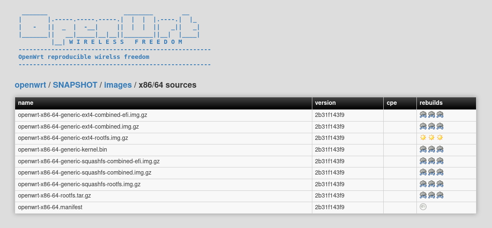

# Reproducible Builds Collector

This is the very early development of a collector for **[rbvf]**. The `rbvf`
files contains **re**build results to show what distributed binaries of open
source projects are reproducible. Results are stored in a database to generate stats, warnings and if provided by the rebuilder, artifacts like [diffoscope] outputs or actual binaries.

The collector essentially uses `origins` and `rebuilders`, where `origins` are open source projects like Archlinux, Debian or OpenWrt and `rebuilders` are whoever wants to verify that files provided on download servers are what they state. Those two information sources are stored and kept track on.

Currently a OpenWrt snapshot verifier is implemented, however more projects are planned. 

[rbvf]: https://github.com/aparcar/reproducible-builds-verification-format
[diffoscope]: https://diffoscope.org/