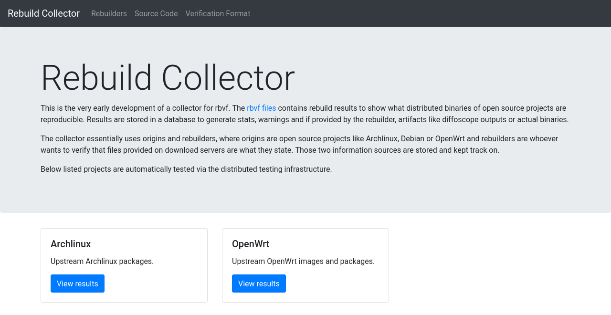

# Reproducible Builds Collector

This is the very early development of a collector for **[rbvf]**. The `rbvf`
files contains **re**build results to show what distributed binaries of open
source projects are reproducible. Results are stored in a database to generate
stats, warnings and if provided by the rebuilder, artifacts like [diffoscope]
outputs or actual binaries.

The collector essentially uses `origins` and `rebuilders`, where `origins` are
open source projects like Archlinux, Debian or OpenWrt and `rebuilders` are
whoever wants to verify that files provided on download servers are what they
state. Those two information sources are stored and kept track on.

Currently a OpenWrt snapshot verifier is implemented, however more projects are
planned. 



[rbvf]: https://github.com/aparcar/reproducible-builds-verification-format
[diffoscope]: https://diffoscope.org/

## Design

The collector tries to be modular to support a variation of origins and
rebuilders. Find current implementations in the folders `sources/` and
`results/`. All fetched data is stored in either a Sqlite or PostgreSQL
database, later render via Jinja2 to a static website.

Currently supported **source** fetching from origins:

* [Archlinux](https://archlinux.org)
* [OpenWrt](https://openwrt.org)

Currently supported **result** fetching from rebuilders:

* GitLab CI artifacts
* GitHub CI artifacts
* [Rebuilderd](https://github.com/kpcyrd/rebuilderd)

Templates for the website are found in the `templates/` folder.

## Development setup

Ideally setup a Python virtual environment and install all requirements and the
collector itself via the following command:

```bash
pip install -e .
```

Copy `config.yml.example` over to `config.yml` and insert secret tokens in case
you want to use the artifacts from GitLab CI or GitHub CI.

### Using test data for the database

Instead of parsing remote sources it is also possible to use test data. To load
the data from `./tests/testdata` run the following command:

```bash
rbcollector util load --dir ./tests/testdata
```

### Rendering the site

To render all content of the database run the following command:

```bash
rbcollector render-site
```

The default destination is `./public`.

### Setup PostgreSQL  database

Run the following command to setup a PostgreSQL database. Once done the database
in `config.yml` can be modified to use PostgreSQL instead of Sqlite.

```bash
psql --username postgres -c "CREATE DATABASE collector"
psql --username postgres -c "CREATE USER collector WITH PASSWORD 'secret'"
psql --username postgres -c "GRANT ALL ON DATABASE collector TO collector"
```


